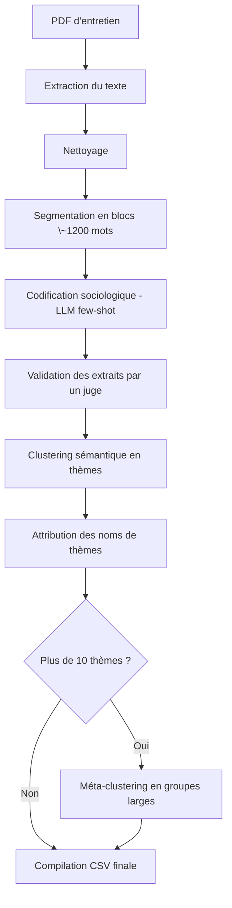

# 🧠 Agentic Code Social

> Analyse qualitative automatisée d'entretiens sociologiques avec LLM et clustering sémantique.

Ce projet exécute un pipeline complet d’analyse de contenu sociologique à partir de fichiers PDF d’entretiens. Il utilise du reasoning en chaîne (Chain-of-Thought), du few-shot prompting et des modèles LLM pour produire des **codes thématiques** enrichis, puis les regroupe automatiquement en **thèmes** et **méta-thèmes**.

---

## 🚀 Fonctionnalités principales

* 📄 Extraction de texte depuis des PDF
* ✂️ Segmentation intelligente du texte
* 🧠 Codification sociologique par LLM (Chain-of-Thought + few-shot)
* ✅ Vérification des extraits par un "juge"
* 🧩 Clustering sémantique en thèmes
* 🏷️ Attribution automatique des noms de thèmes
* 🧲 Méta-clustering si trop de thèmes
* 📊 Export final en CSV

---

## 📆 Prérequis

### Environnement

* Python 3.8 ou supérieur
* Compte Groq + clé API
* Modèles utilisés : `meta-llama/llama-4-maverick-17b-128e-instruct`, `llama3-8b-8192`, etc.

### Installation

```bash
# Créer et activer l'environnement virtuel
virtualenv -p python3 env
source env/bin/activate

# Installer les dépendances
pip install -r requirements.txt
```

### Configuration

Créer un fichier `.env` à la racine du projet avec votre clé :

```env
GROQ_API_KEY=your_api_key_here
```

---

## 🧽 Pipeline d’analyse



---

## 🛠️ Utilisation

```bash
python main.py "chemin/vers/entretien.pdf" --output "resultats.csv" --max-themes 10
```

### Options

* `--output` : fichier de sortie (CSV)
* `--max-themes` : nombre maximal de thèmes principaux (default = 10)

---

## 📝 Exemple de résultat

| Méta-thème                            | Thème                              | Code                      | Extrait                                      |
| ------------------------------------- | ---------------------------------- | ------------------------- | -------------------------------------------- |
| Pratiques numériques et apprentissage | Usage pédagogique de l'IA          | Complémentarité cognitive | « le raisonnement que je vais présenter... » |
| Tensions normatives                   | Rapport à la légitimité académique | Anxiété normative         | « ça me brise le cœur de me dire... »        |

---

